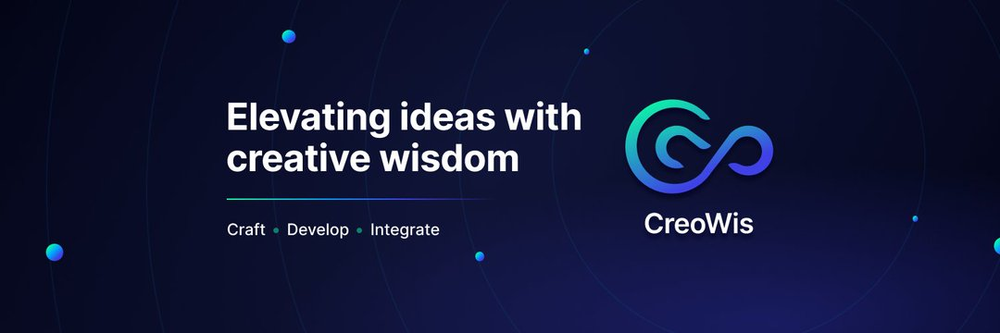

  <h4> Questions? Ideas? Let’s chat! Feel free to reach out to us:</h4>

  
  
  

## 📌 What we do

**CreoWis** is a technology solutions provider with a simple goal: turn your ideas into impactful digital products. Founded by industry veterans, we bring deep technical knowledge and a passion for problem-solving to every project.

Our expertise covers a range of services to support your product journey, from idea to execution.

Here’s a quick look at what we offer:

- **Digital Product Development**  
  We transform ideas into high-quality digital products, prioritizing usability and scalability.

- **Architecture as a Service**  
  From tech stack recommendations to training, we provide architectural guidance for building resilient systems.

- **User Experience Design (UXD)**  
  We ensure seamless, user-centered designs, handling everything from research to storyboarding.

- **MVP Development**  
  Need to get to market fast? We help you launch your MVP quickly, gather feedback, and iterate.

- **App Modernization**  
  Upgrade legacy systems with our expertise in migration, security, and performance.

- **DevOps**  
  Streamline your development with automation, CI/CD, and containerization for faster delivery.

- **Brand Identity**  
  Create a memorable brand with our visual identity services, from logos to color schemes.

- **Training & Education**  
  Upskill your team with our training programs in web design, system architecture, and cloud technologies.

## 🤝 Let’s Collaborate!

We’re always excited to work with like-minded clients who are ready to make an impact. Whether you have a fully-fledged concept or just the beginning of an idea, let’s bring it to life together!

Feel free to reach out to us on
**email** at [hello@creowis.com](mailto:hello@creowis.com) or 
via **WhatsApp** at **+91 89045 01731**. 

We’d love to hear from you!

## 🤝 Contribute to our open source projects

Interested in contributing to our projects? Here’s how you can get involved:

1. **Explore Our Repositories**: Check out our public projects and see where you’d like to contribute.
2. **Report Issues**: Found a bug? Help us improve by opening an issue in the relevant repository.
3. **Suggest Enhancements**: Have an idea for improvement? We’re all ears!
4. **Pull Requests**: Ready to code? Submit a PR, and our team will review it.

## 🌐 Connect with Us

  <h4> Stay updated with our latest projects, insights, and more. Follow us on social media:</h4>

  
  
  
  )

 <h4> We’d love to connect and keep you inspired with our journey!</h4>

## 🔗 More About Us

Want to learn more? Here are some additional resources:

- [Blog](https://creowis.com/blog) – Insights from our team.
- [Careers](https://www.creowis.com/career) – Join our talented team.
- [Testimonials](https://www.creowis.com/#testimonial-section) – What our clients say.

---
_We’re excited to have you here and look forward to collaborating with you!_

_© 2024 CreoWis Technologies. Crafted with passion by the CreoWis Team ❤️_

